## Recordatorios
- Para la competencia puedes hacer el snipped en cualquier archivo no coloques tabs, luego remplaza \r?\n por \\n, no te olvides el snipped de out

## Chapter 1

1.  En big O siempre que hay un log es base 2 a menos que se aclare lo contrario.
2.  Las PC's de los jueces pueden hacer $10^8$ OPERACIONES por segundo, si un ciclo es 0 -> 10^8 pero tiene en su interior 30 operaciones eso son 30 segundos.

```C++
int main()
{
    long long a = 0;
    for(long long i = 0; i < 1e8 ; i++)
    {
        for(int j = 0; j < 30 ; j++)
            a += i;
    }
    return 0;
}
```
- Entonces ya que casi siempre se realiza operaciones complejas dentro los bucles O($10^7$) entra en 1 segundo.

3.  Usar comandos para comparar input y output
4.  TLE si la complejidad es correcta hay un ciclo infinito
5.  RTE el juez BOCA puede dar RTE cuando en realidad es Memory Limit.
5.  Precomputar
    - cuando la variable es GLOBAL se hace en tiempo de COMPILACION
    - cuando es LOCAL se hace en tiempo de EJECUCION

```C++
ll a[92+1] = { 0, 1, 1, 2, 3, 5, 8, 13, 21, ....};
ll fibo(ll n)
{
    if(a[n] != 0)
    {
        return a[n];
    }
    else
    {
        a[n] = fibo(n-1) + fibo(n-2);
        return a[n];
    }
}
int main() {
    ll b[92+1] = { 0, 1, 1, 2, 3, 5, 8, 13, 21, ...};
    return 0;
}
```

- Para precomputar estructuras de datos complejas debemos precomputarlas en un array y luego insertarlas a nuestra estructura.

```C++
ll a[92+1] = { 0, 1, 1, 2, 3, 5, 8, 13, 21, ...};
ll fibo(ll n)
{
    if(a[n] != 0) 
        return a[n];
    else
    {
        a[n] = fibo(n-1) + fibo(n-2);
        return a[n];
    }
}
int main() {
    priority_queue<int> b;
    for(auto i: a)
        b.push(i);
    int i = 0;
    while(!(b.empty()))
    {
        b.pop();
        i++;
    }
    cout << i; // output: "93"
    return 0;
}
```

- esto tambien es posible

```C++
  vector<long long> a = { 0, 1, 1, 2, 3, 5, 8, 13, 21, ...};
```

## Chapter 2
### 2.4. Data Structures with our own libraries
#### 2.4.1. Graphs

- Equivocacion libro: "The Adjacency Matrix AM" pag.95  
    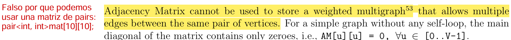
- Mejor no usar tuple  
    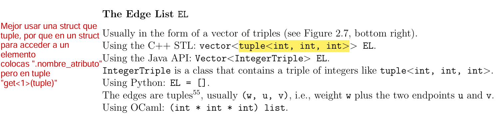
- Para grafos con vertices no contiguos(contiguos: 1, 2, 3... - no contiguos: nombres, etc) es buena idea usar `unordered_map`

```C++
unordered_map< llave , valor>
unordered_map< string , vector<int>> graph;
```

- for auto en unordered_map solo recorre las llaves que existen, no la hash completa

```C++
mapita["lucas"] = 1;
mapita["leo"] = 7;
mapita["mario"] = 4;
for(auto i: mapita)
{
    cout << i << endl;
}
//output:"7, 4, 1" ya que es una hash,
el orden no depende de como hayamos ingresado los datos
```

- Un grafo completo(o tambien llamado Convexo)
        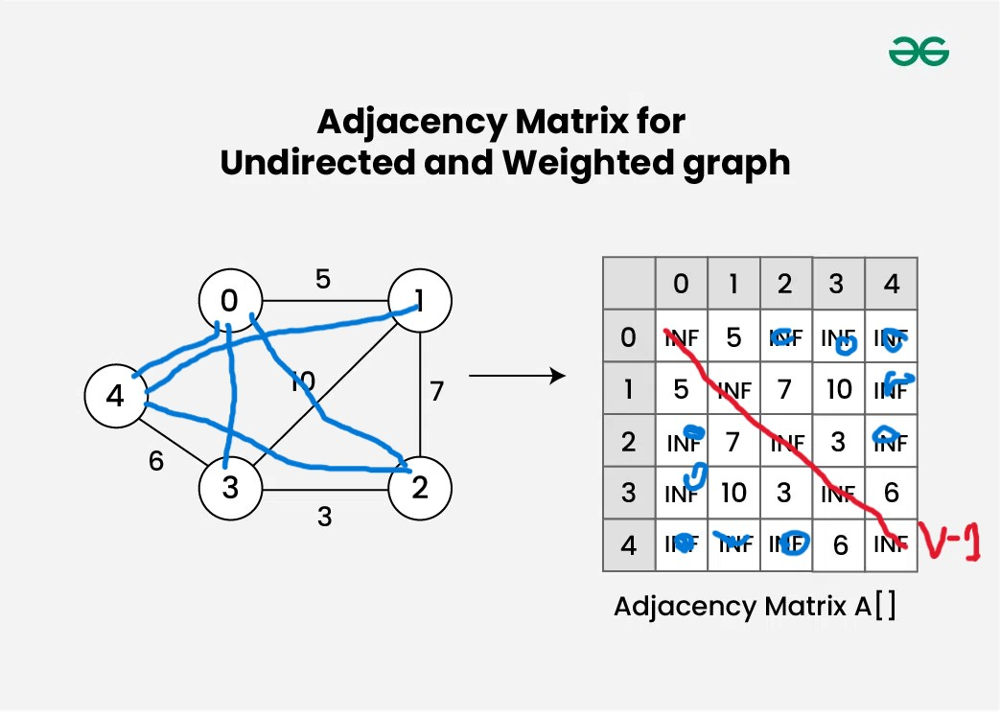
    - Para un grafo completo no dirigido O(V*(V-1))  
    - Para un grafo completo dirigido O(Vx(V-1)/2)
    - Con un array de padres puedes obtener el Spanning Tree(arbol de expansion) generado por un DFS/BFS

```C++
p[1] = -1   // raíz no tiene padre
p[2] = 1
p[3] = 1
p[4] = 1
p[5] = 2
p[6] = 2
```

- In-degree y Out-degree  
    A → B  
    A → C  
    D → A  
    Entonces:
    - grado de salida(Out-degree) de A = 2 (porque va hacia B y C)
    - grado de ingreso(In-degree) de A = 1 (porque D apunta hacia A)
- Traspuesta de una matriz  
    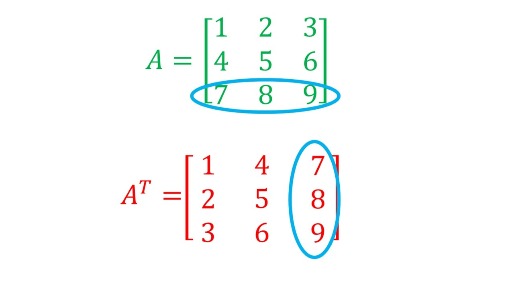
- Grafo estrella  
    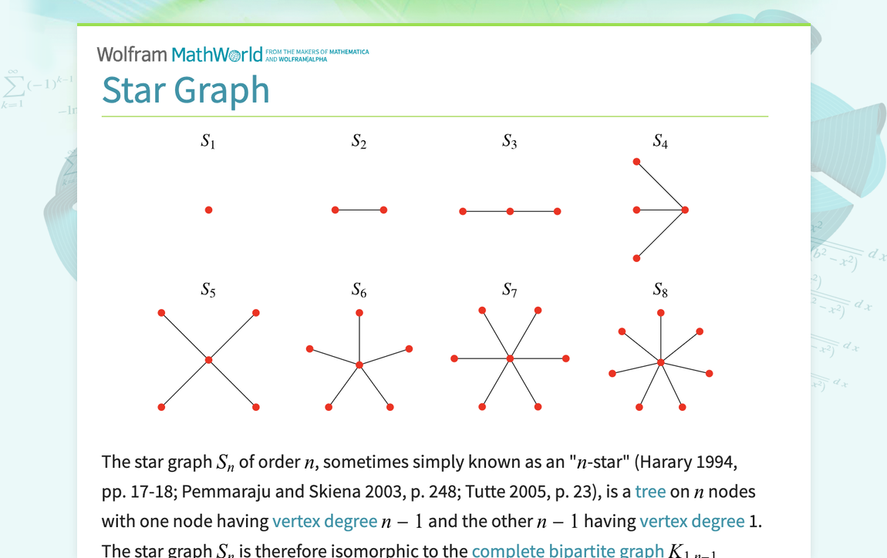
    - Los grafos estrella son bipartitos si tomamos al vertice del medio como parte del conjunto A y a todos los demas como parte del conjunto B.
- Grafo complementario.- contiene todas las aristas que no existen en el grafo original  
    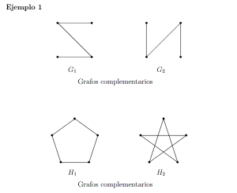

#### 2.4.2. Uniond find
- def.- A FOREST of trees.
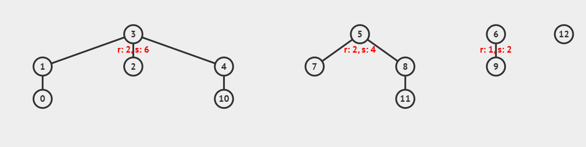
- Cada que unimos dos Sets del mismo RANK(altura subgrafo, rank=4, size=16) nuestro rank aumenta en +1.Entonces para formar un RANK r se necesitan por lo menos $2^r$ vertices.
    - Ejemplo rank+1
        - rank = 1
    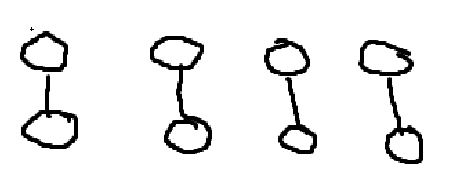
        - rank = 2
    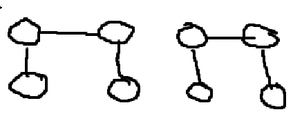
        - rank = 3
    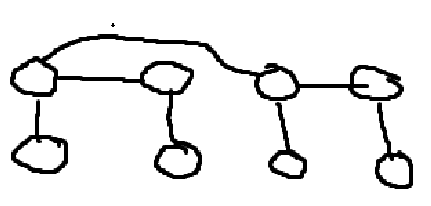
    - Ejemplo2 rank+1
        - Inicial
    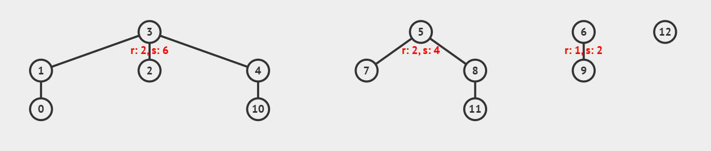
        - Despues de UniondSet(3,5)
    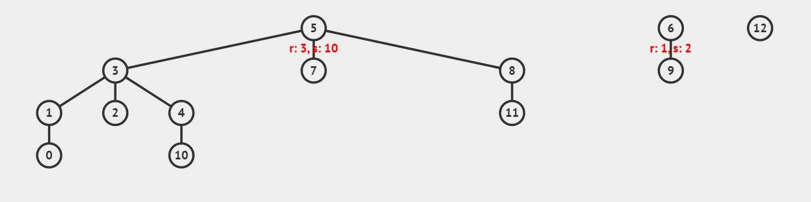
    - Ejemplo Path compresion
    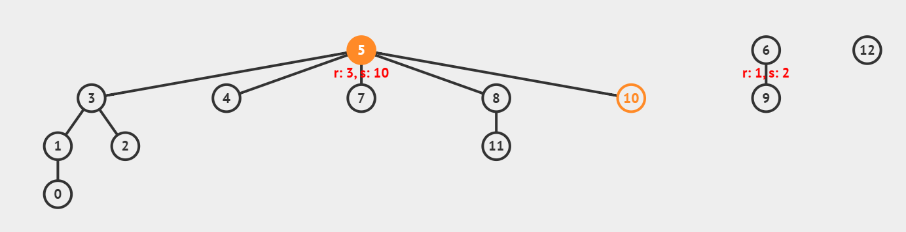
        - FindSet(10) ahora 4 y 10 apuntan al superpadre 5

- Tambien se puede usar `set<>`, el problema de esta implementacion es que si queremos unir 1 con 6 tenemos que buscar primero 1 y 6 en nuestros sets, y luego recien unirlos, otro problema de esta implementacion es que en realidad tendriamos un vector de sets.

```C++
int main() {
    std::set<int> A = {1, 3, 5, 7};
    std::set<int> B = {2, 3, 6, 7, 8};
    if(A.size() < B.size()) swap(A,B);
    // Opción 1: modificar A para que sea A ∪ B
    A.insert(B.begin(), B.end());
    // Ahora A == {1,2,3,5,6,7,8}
}
```


#### 2.4.3. fenwick tree

- Cuando i es potencia de 2 (2, 4, 8), el rango es \[1..i\]\[1..i\]
- Para impares no potencias de 2, el rango es trivial \[i..i\]\[i..i\]
- En valores intermedios (6, 10, …), agrupa los últimos 2 o más elementos según LSOne(i).

#### 2.4.3. Segment Tree
- Build O(V) donde v son los vertices del segment tree, entonces si construimos un st en base a un vector A con tamaño "A" , Build(4*A)
- ¿Por que st es de tamaño 4*A?
    - Un arbol binario de tamaño de exactamente alguna potencia de 2 tiene 2*n nodos(n = nodos de la base(nodos hoja), en esta caso el vector original A).Entonces "un arbol con un tamaño menor" como n-1, NO va a tener mas de 2*n nodos. Por eso hacemos que nuestro tamaño A sea la siguiente potencia de dos, la cual no es mas del doble de A lo cual es 2*A, entonces si tamaño_arbol_mas_grande = 2*A, sus nodos seran 2*tamaño_arbol_mas_grande, lo que es equivalente a 2*2*A.
    - ⌊x⌋ trucar(aproximacion hacia abajo 3.88 = 3)
    - ⌈x⌉ redondear(aproximacion hacia arriba 3.88 = 4)
    - 2\*2^⌈(log2(n))⌉ = 2\*2\*n
- Cuando hacemos un update realmente no se actualizan los nodos hojas, sino solo actualizamos x de los nodos superiores, done x \< N (donde x es mucho menor que N), en vez de N actualizaciones(lazy propagation), solo cuando el nodo hoja sea consultado con una QUERY ese nodo sera actualizado.
    - Lazy update = actualizacion retrasada

| 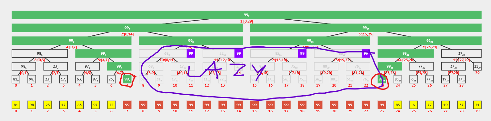 |
|:---------------------------:|
| _UPDATE(l=7,r=23,val=99)_ |
|_Lo que esta en morado no fue realmente actualizado en A pero si sus rangos(nodos superiores), los nodos encerrados en rojo tuvieron que ser actualizados ya que ningun nodo superior cubre su rango la gran ventaja fue que actualizamos 6 nodos en total en vez de los 16 nodos hoja_  |
### 2.3. Non-Linear Data Structures with built-in libraries
#### 2.3.1. Priority_queue
Por defecto es de MAYOR a MENOR, osea mayor en el top.
Podemos invertir el orden convirtiendo todos los numeros a negativos.
##### Create
- O(n)
```C++
vector<int> d = {12,3,4,3,3,5,34,343,5325,235,23452,3532};
priority_queue<int> a (d.begin(), d.end());
```
- O(n * log n)
```C++
vector<int> d = {12,3,4,3,3,5,34,343,5325,235,23452,3532};
priority_queue<int> a;
for(auto i: d)
    a.push(i);
```
##### Partial Sort
Cuando Solo necesitamos los primeros k elementos de un array.
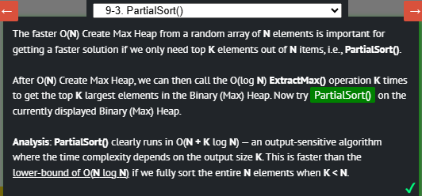

##### Update and delete on priority_queue C++
Update: Dijskstra lo utiza de forma indirecta ya que efectivamente ****C++ no permite hacer `update()` directamente en un `priority_queue`**** pero podemos usar **#include <bits/extc++.h>** que tiene una version extendida de priority queue.

*****Entonces... ¿Cómo se simula el `update()` en C++?*****
La técnica que se usa (como en el código del libro) es:
****Simplemente **se inserta una nueva copia** con la mejor distancia:****
```cpp
pq.push({dist[v], v});
```
Y luego, **al sacar el tope de la cola**, se verifica si esa copia es válida o desactualizada:
```cpp
auto [d, u] = pq.top(); pq.pop();
if (d > dist[u]) continue; // ⚠ muy importante
```
****¿Por qué esto funciona?****
Supongamos que a un vértice `u` se le insertó una copia con `dist[u] = 10`, pero luego se encontró un mejor camino con `dist[u] = 6`. Entonces ahora habrá **dos copias** de `u` en la cola:
* `{10, u}` (vieja)
* `{6, u}` (nueva)

Como el `priority_queue` ordena por el valor más bajo (`greater<ii>`), la copia con `6` saldrá primero. Cuando salga:

```cpp
if (d > dist[u]) continue;
```

El `d == dist[u]`, así que **se procesa**.

Pero luego, cuando salga `{10, u}`, se ejecuta:

```cpp
if (d > dist[u]) continue;
```

→ Como `10 > 6`, esa copia se **descarta** (se ignora), y así se evita hacer trabajo innecesario o incorrecto.

- Delete: se me ocurre que podriamos hacer algo similar al update, pero en vez de 6 que es el valor que no ayuda a descartar a 10 con un valor muy pequeño que en realidad no existe.

###### Nota: Tener en cuenta que esto solo funciona si la actualizacion siempre es menor, o siempre es mayor, ya que solo asi se puede hacer el descarte.

#### Hash table
Es muy importante que segun la entrada, reservemos la cantidad de espacios a 2*N previamente para evitar rehashings.

##### unordered_map
Almacena pares CLAVE,VALOR
- Tamaño ideal n*1.33
```C++
int n = 1e6;
unordered_map<string,int> a;
a.reserve(n*1.33);
// Este 1.33 se puede demostrar con la formula
// si no recuerdo mal dependia de los numeros primos
```
- Acceso con claves
```C++
unordered_map<string,int> a;
a["lucas"] = 10;
// si no habia nada en lucas a["lucas"] devuelve 0
```
##### unordered_set
Solo valores, te dice si una clave existe o no
```C++
//
unordered_set<string> a;
if(a.find("lucas") != a.end())
    cout << "existe" << endl;
```

##### Es posible modificar la formula de una hash
```C++
const int input = 1e5;
struct formula{
  size_t operator()(const pair<string, string>& s) const {
    long long sum = 0;
    int mult = 1;
    for(auto i:s.first)
    {
      sum += (mult*i);
      mult++;
    }
    mult = 1;
    for(auto i:s.second)
    {
      sum += (mult*i);
      mult++;
    }
    return sum%int(input);
  }
};

int main()
{
  ios::sync_with_stdio(0);
  cin.tie(0);
  
  unordered_set<pair<string , string>, formula> my_hash;
  my_hash.reserve(input);// INPUT
  string a, b;
  while (cin >> a >> b)
  {
    my_hash.insert({a, b});
  }
  
  for(auto i: my_hash)
    cout << i.first << " " << i.second << endl;
  cout << my_hash.load_factor() << endl;
  // Promedio de colisiones
      
  return 0;
}
```

#### BST
##### Map (Clave->valor)
Es un BBST(balanced binary search tree) en c++ esta implementado como Reb Black Tree con punteros(al estar implementado con punteros la cache tiene que acceder a memoria no continua y por lo tanto no es tan eficiente).

- *****¿ Si begin(devuelve el menor elemento) O(1) + erase es O(log n) por que existe priority queue top O(1) + pop O(log n)?*****
Aunque la complejidad asintotica es la misma en al ejecucion el hecho de usar punteros hace la diferencia.Ya que la priority queue usa un array(hijo derecho(2*p) , hijo izquierdo (2*p +1)) el acceso a memoria es casi secuencial.

- *****Ordenado*****
Entonces lo podemos recorrer en orden(de menor a mayor) con:
```C++
for(auto& i: map)
```

###### Nota: tambien podemos usar upper_bound y lower_bound

##### Multimap(clave->valor)
Permite varios valores con la misma clave.

##### Set(solo valores)
No permited elementos duplicados, como tambien es un BBST tambiem podemos recorrerlo en orden usar upper_bound y lower bound , begin es el menor, end el mayor ,etc.

- Obtener el k-esimo elemento de un BST cualquiera con advance O(n), pero con order statistic tree es O(n log n)
```C++
int main() {
  ios::sync_with_stdio(0);
  cin.tie(0);
  cout.tie(0);

  set<int> a;// Cualquier otro arbol
  form(i,1,10)
    a.insert(i);
  auto it = a.begin();
  advance(it, 5);/* O(n) por que son punteros 
  entonces realmente los recorre como una lista enlazada*/
  cout << (it).operator*() << endl;
  //output: 6
  return 0;
}
```

#### Order Statistic Tree
- Ranking(v) = posicion del elemento v
- Select(k) = k-esimo elemento mas pequeño
##### Quick sort O(n log n)
- Al colocar todos los mayores y menores al pivote, a los costados del pivote genera que el pivote este en el indice que le correspondera cuando el array este completamente ordenado.
arr = [4,8,10,2,1,9] 
primer partition con pivote 4:[2,1,4,10,8,9]
4 ya esta en el lugar que le corresponde cuando todo el array este completamente ordenado [1,2,4,8,9,10], entonces podemos dejarlo ahi ([2,1,4,10,8,9]) y concentrarnos en colocar los demas en sus lugares.
##### Quick Select(Select(k) = k-esimo elemento mas pequeño)
Podemos hacer el mismo procedimiento de quick sort y cuando el pivote sea el k-esimo elemento paramos.

##### Tree para select en O(n* log n)(#include <bits/extc++.h>) 
```C++
#include <bits/stdc++.h>
using namespace std;

#include <bits/extc++.h>                         // pbds
using namespace __gnu_pbds;
typedef tree<int, null_type, less<int>, rb_tree_tag,
             tree_order_statistics_node_update> ost;

int main() {
  int n = 9;
  int A[] = { 2, 4, 7,10,15,23,50,65,71};        // as in Chapter 2
  ost tree;
  for (int i = 0; i < n; ++i)                    // O(n log n)
    tree.insert(A[i]);
  // O(log n) select
  cout << *tree.find_by_order(0) << "\n";        // 1-smallest = 2
  cout << *tree.find_by_order(n-1) << "\n";      // 9-smallest/largest = 71
  cout << *tree.find_by_order(4) << "\n";        // 5-smallest = 15
  // O(log n) rank
  cout << tree.order_of_key(2) << "\n";          // index 0 (rank 1)
  cout << tree.order_of_key(71) << "\n";         // index 8 (rank 9)
  cout << tree.order_of_key(15) << "\n";         // index 4 (rank 5)
  
  return 0;
}
```
## Chapter 3
### 3.2. Complete Search
- Generar todas las posibilidades
- Backtracking: Si vemos que alguna posibilidad es imposible que sea optima nos detenemos(podamos)
### 3.2. Greedy
- La propiedad greedy es la garantía de que si eliges lo que parece mejor ahora (sin considerar consecuencias futuras), igualmente llegarás a la mejor solución global.
### 3.2. Divide an conquer
- Sub-problemas independientes: la resolucion de uno no afecta a otro, y no debemos tomar en cuenta a otro sub-problema para resolver el actual.

### 3.3. Dinamyc programming
- Es una busqueda completa que aprovecha que algunos sub-problemas se solapan con otros calculandolos solo una vez.
#### Clasical Problems

#### 1. Wedding shopping
- ¿ Que son los estados ?
Es la informacion necesaria para resolver un sub-problema:
    - Estaodos implementacion Recursiva:suele coincidir con los parametros de las funciones.
    - Estaodos implementacion Iterativa:suele corresponder a los indices de la tabla.

- Relaciones o trancisiones
    * En **recursión**: son las llamadas recursivas. Ejemplo:
    ```cpp
    dp(g, b) = max( dp(g+1, b - price[g][i]) ... )
    ```
    Cada llamada corresponde a “moverse” a otro estado con distinta prenda y presupuesto.
    * En **iteración**: son las fórmulas que llenan la tabla. Ejemplo:
    ```cpp
    dp[g][b] = max(dp[g-1][b - price[g][i]] + price[g][i], ...)
    ```
    Aquí las transiciones aparecen en el orden en que llenas la tabla.
- Tables
    - Tabular table(iterativo):Iniciamos la primera fila con nuestros valores.Podemos usar solo 2 filas.
    - Memo table(recursivo):Iniciamos todo en un valor no usado como -1. 
- Iterativo vs Recursivo 
    - Top-down: ahorra tiempo al evitar estados innecesarios (bueno si el espacio de estados es muy grande pero solo se visitan pocos).

    - Bottom-up: garantiza recorrer todo el espacio de estados (aunque algunos no sirvan), pero evita completamente overhead de recursión y puede ser más rápido cuando la mayoría de estados sí se usan.

#### 2. 1D Max sum
- O(n) Greedy + DP (algoritmo de Kadane)
    - ningún subarreglo óptimo puede incluir un prefijo cuya suma sea negativa.Porque si lo incluyera, quitarlo daría una suma mayor.

Cuando en la explicación de Kadane se dice “si el **prefijo** es negativo lo descarto”, se está hablando de los **prefijos del subarreglo candidato que estoy construyendo**, no necesariamente del arreglo completo.
### 📌 Caso 1: `[2, 3, -4, -1]`
* Vas sumando:
  * `2` → suma = 2
  * `2+3` → suma = 5
  * `5+(-4)` → suma = 1 (todavía ≥ 0, sigo)
  * `1+(-1)` → suma = 0
* Kadane detecta que lo máximo se consiguió en el prefijo izquierdo `[2, 3]`.
* Al final es como si hubiera **descartado la cola derecha** negativa `[-4, -1]`.
### 📌 Caso 2: `[-4, -1, 2, 3]`
* Vas sumando:
  * `-4` → suma = -4 → como es < 0, reinicio.
  * `-1` → suma = -1 → otra vez < 0, reinicio.
  * `2` → suma = 2
  * `2+3` → suma = 5
* Kadane termina quedándose con `[2, 3]`.
* Aquí es como si hubiera **descartado la parte izquierda negativa** `[-4, -1]`.
### 🔹 Entonces, ¿qué significa “prefijo” en Kadane?
No es el prefijo de todo el arreglo, sino del **subarreglo candidato que va terminando en la posición actual**.
* Si esa suma parcial (prefijo) se hace negativa, no tiene sentido conservarla: cualquier cosa que agregues a la derecha será mejor empezar desde cero que arrastrar un lastre negativo.
* Así es como Kadane va recortando dinámicamente, ya sea por la izquierda (cuando reinicia) o por la derecha (cuando el acumulado total cae después de un máximo).
✅ **Conclusión con tus palabras:**
Sí, Kadane considera prefijo cualquier bloque en los costados del subarreglo candidato:
* Si es un bloque negativo al inicio → lo descarta reiniciando.
* Si es un bloque negativo al final → queda descartado naturalmente porque el máximo se registró antes.

###### c. 0-1 Knapsack (Subset-Sum)

## Chapter 4
### 4.0. Terminologia
- SCC strongly connected component(solo en Directed Graphs) .- para todo par de nodos u v dentro de la componente hay un camino de u->v y de v->u.
    - Qué es una SCC? (recordatorio clave)
    Una SCC (Strongly Connected Component) es un subconjunto MAXIMO de nodos donde cada nodo puede alcanzar a todos los demás por caminos dirigidos.
    “Máximo” significa que no puedes añadir ningún otro nodo sin perder la propiedad de fuerte conexión.
    Entonces solo hay dos posibilidades:
        - Un ciclo
        - Un unico nodo
    - Descomponiendo un Grafo en SCCs
    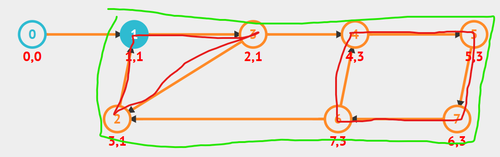
    Las unicas SCCs es 0 y el camino verde.
    El rojo 1->3->2->1 forma un ciclo pero puedes añadir 4,5,6,7(camino verde) y la propiedad no se pierde.
    Y eso hace que la descomposición en SCCs sea única.
    ⚠️ No hay dos formas válidas de dividir el grafo en SCCs — el resultado es único, como los componentes conexos en un grafo no dirigido.
- Cut vertex.- VERTICE que si es eliminado aumenta el numero de sub-grafos conexos.
- Bridge(puente).-ARISTA que si es eliminada aumenta el numero de sub-grafos conexos.
- Grafo conexo(connected).- si existe un camino(no necesariamente directo puede ser mediante nodos intermedios) desde cualquier nodo "u" a un node "v".
- Grafo no conexo.- un grafo con 2 o mas sub-grafos conexos.
- Multigraph.- grafo con multiples aristas entre 2 mismos vertices.
- Simplegraph.-una unica arista entre dos mismos vertices.
- Grafo Fuertemente Conexo (Directed): Este concepto se aplica a grafos dirigidos. Un grafo es fuertemente conexo si para cada par de vértices u y v, existe un camino de u a v Y un camino de v a u. Los caminos no tienen por qué ser directos; pueden pasar por otros vértices.
- Grafo Completo (Undirected): Es un grafo simple y no dirigido donde cada par de vértices distintos está conectado por una arista directa. Es la máxima densidad posible de aristas.
    - $0<= E <= (V*((V-1)/2))$
    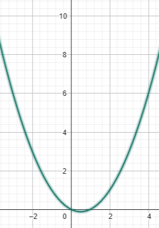
- Wheel graph(grafo rueda)

    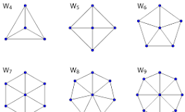

- Line Graph (Grafo de Líneas): Un grafo que se crea a partir de otro: las aristas del grafo original se convierten en los vértices del nuevo grafo.
- Sparse/Dense (Disperso/Denso): Un grafo es disperso si tiene pocas aristas (cercano a |V|). Es denso si tiene muchas aristas (cercano a |V|²). Esto es importante para elegir la representación correcta (Lista de Adyacencia para dispersos, Matriz de Adyacencia para densos).
- Reachable (Alcanzable): Un vértice 'v' es alcanzable desde un vértice 'u' si existe un camino de 'u' a 'v'. Esto se determina con DFS o BFS.
- Matching (Emparejamiento): Un subconjunto de aristas donde no hay dos aristas que compartan un vértice. Se usa para resolver problemas de asignación.
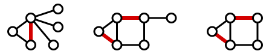
- Eulerian (Euleriano): Un camino/tour euleriano es aquel que recorre cada arista del grafo exactamente una vez. Se puede determinar si existe un camino así analizando los grados de los vértices.
- Hamiltonian (Hamiltoniano): Un camino/tour hamiltoniano es aquel que visita cada vértice del grafo exactamente una vez. Encontrar uno es un problema NP-difícil, mucho más complejo que el euleriano.
-Line (Línea): Generalmente se refiere a un grafo que es simplemente un camino, sin ramificaciones. Es un tipo de árbol muy simple.
- Isomorphism (Isomorfismo): Dos grafos son isomórficos si tienen exactamente la misma estructura (la misma "forma"), aunque los nombres de los vértices sean diferentes. Es como si pudieras re-etiquetar los vértices de un grafo para obtener el otro.
### 4.1. DFS
- Iterativo.- la gran ventaja que tiene sobre el recursivo es que no depende de la memory stack($10^5$ llamadas recursivas max), ya que utiliza la estructura de datos stack que utiliza la memory heap.
### 4.2. Topological sort
En cualquier **grafo dirigido acíclico finito (DAG)** siempre existe **al menos un vértice con outdegree 0** (un *sumidero*) y, simétricamente, **al menos uno con indegree 0** (una *fuente*).

#### Demostración 1 (por contradicción, “camino infinito”)

Supón que **no** existe vértice con grado de salida 0. Entonces **cada** vértice $(v)$ tiene al menos una arista saliente $v \to u$ .
Elige cualquier vértice $(v_0)$ y sigue siempre “alguna” arista saliente:
$[
v_0 \to v_1 \to v_2 \to \cdots
]$
Como el grafo es **finito**, tarde o temprano se repite un vértice: $(v_i = v_j)$ con $(i<j)$. El segmento
$[
v_i \to v_{i+1} \to \cdots \to v_j(=v_i)
]$
forma un **ciclo dirigido**, contradiciendo que el grafo es acíclico. Luego, nuestra suposición es falsa y **existe** un vértice con **grado de salida 0**.

*(El mismo argumento, invirtiendo las aristas, prueba que existe un vértice con **grado de entrada 0**.)*

#### Demostración 2 (por camino más largo)

Sea $(P = v_1 \to v_2 \to \cdots \to v_k)$ un **camino dirigido más largo posible** en el DAG (existe porque el grafo es finito y no hay ciclos). Si $(v_k)$ tuviera alguna arista saliente $(v_k \to w)$, entonces
$[
v_1 \to \cdots \to v_k \to w
]$
sería un camino más largo que $(P)$, contradicción. Por lo tanto, $(v_k)$ **no** tiene aristas salientes: es un **sumidero**.

#### Corolario (orden topológico)

De estos lemas salen propiedades clásicas:

* Siempre hay **una fuente** (indegree 0) y **un sumidero** (outdegree 0).
* En Kahn (BFS topo) puedes **empezar** por alguna fuente; en el orden topológico, el **último** vértice puede tomarse como un sumidero.


### 4.3. Tarjan
Primero que es una SCC strongly connected component es un grafo dirigido en el cual hay un camino para todo par de aristas u y v, u->v y v->u , para que esto se cumpla el grafo tiene que ser si o **un grafo que tiene un ciclo que contiene a todos los nodos** o **un único nodo**. Lo que hace Tarjan es descomponer un grafo en varias SCC y solo existe una unica descomposición porque cada SCC debe ser la MAXIMA posible esto quiere decir que no debe ser posible añadir mas nodos a una componente y seguir manteniendo la propiedad de una SCC.
##### ¿Todos los nodos de una SCC siempre pertenecen a un ciclo en comun?
Si.
Pensemos en un SCC cualquiera con un conjunto de nodos $S = \{u_1, u_2, u_3, \dots, u_k\}$.
Podemos construir ese "ciclo en común" (recorrido) muy fácilmente:
1.  Empieza en $u_1$.
2.  Como es un SCC, **existe un camino** desde $u_1$ hasta $u_2$.
3.  Desde $u_2$, **existe un camino** hasta $u_3$.
4.  ...
5.  Desde $u_{k-1}$, **existe un camino** hasta $u_k$.
6.  Finalmente, desde $u_k$, **existe un camino** de vuelta a $u_1$.
Si "pegas" todos esos caminos uno detrás del otro, has creado un "super-ciclo" (un **recorrido cerrado** o *closed walk*) que empieza y termina en $u_1$ y que, por construcción, ha visitado $u_2, u_3, \dots, u_k$ en el proceso.
##### NOTA: 
**When the SCCs of a directed graph are contracted,the resulting graph of super vertices is a DAG**.

## Chapter 5 - Mathematics
- factorial de 10^14 es absurdamente grande entonces si queremos saber si n! es divisible por m podemos no calcular n! y simplemente expresarlo en numeros primos y descomponer m tambien en numeros primos y verificar si los numeros primos de m estan en los primos de n!
### 5.3. Number Theory
- Mersenne prime numbers
Un primo de Mersenne es todo número que puede escribirse 
    - M=(2^p)-1 
Donde p es primo, si p no es primo M es compuesto.

### 5.4. Combinatorics
