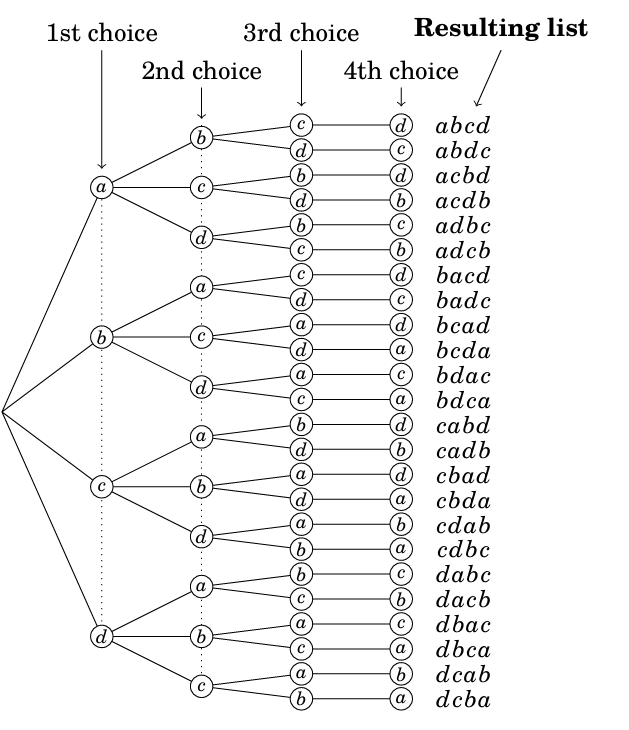
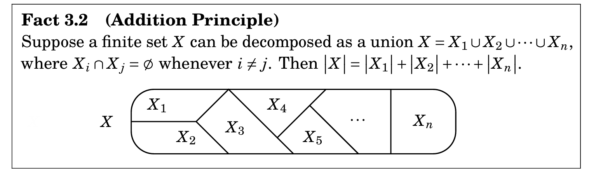
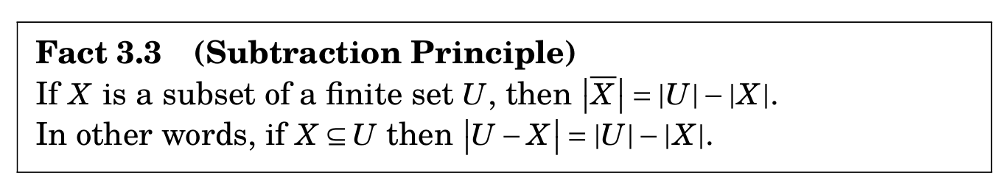
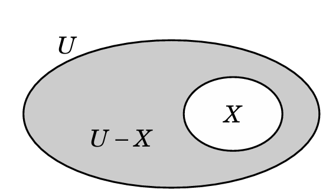

# 3. Counting
- Lista
  - Orden si importa
  - Se denota con (1,2,3)
  (1,2,3) != (2,3,1)
- Set
  - Orden no importa
  - Se denota con {1,2,3}
  {1,2,3} == {2,1,3}

Nos enfocamos en contar todas las formas agrupar listas.
## 3.1. Principio de multiplicacion
### Ejercicio 1
-Sea {a, b,c,d} el conjunto de elementos que podemos usar para formar listas 
- **si la repeticion NO es permitida** $4*3*2*1 = 24$ listas

- **si la repeticion es permitida** $4*4*4*4$ listas

## 3.2. Principio de adicion

- Debemos asegurarnos que **no hay una interseccion** entre los conjuntos que estamos juntando para que una lista no se cuente dos veces.

## 3.3. Principio de substraccion

### Ejercicio (creacion propia)
- Contar las mezclas de una baraja de 52 cartas(4 palos) en 5 posiciones, donde al menos una carta sea roja y todas las demas que no sean rojas sean treboles
Ejemplos validos : RTTTT, RRTTT, RRRR, TRRTT(T=Trebol, R = roja)
Ejemplos invalidos : RTTPT, RPPPT (P = pica)

  - **Solucion:** Contar todos los conjuntos que no tengan picas A = 39*38*37*36*35, todos los conjuntos que no tengan rojo B = 13*12*11*10*9.
  Respuesta final = A - B